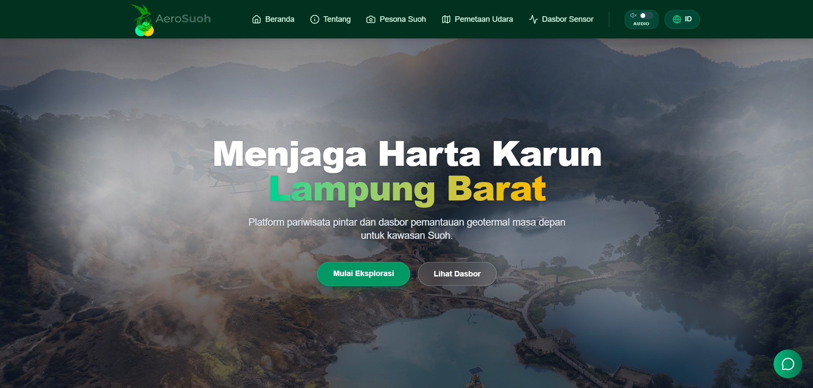

# 🌋 AeroSuoh Eco-Monitor & Smart Tourism



AeroSuoh adalah platform **Pariwisata Ekologis Pintar** dan **Dasbor Pemantauan Geotermal Real-Time** yang didedikasikan untuk mengangkat "Surga Tersembunyi" kawasan Suoh, Lampung Barat ke kancah global. Proyek ini memadukan eksplorasi alam yang indah dengan teknologi pemantauan masa depan yang berfokus pada keselamatan dan keberlanjutan.

## ✨ Fitur Utama

- **🗺️ 3D Aerial Explorer (Mapbox GL)**: Pemetaan satelit interaktif 3D kawasan Suoh lengkap dengan mode "Thermal Camera" dan pelacakan titik koordinat satelit.
- **📊 Real-Time Geothermal Dashboard**: Pemantauan langsung suhu permukaan, arah angin, pH air kawah, dan gas sulfur (H2S) yang terintegrasi dengan API satelit. Tersedia juga animasi *skeleton loader* untuk transisi data yang mulus.
- **🎫 Smart Booking System**: Sistem pemesanan tiket cerdas (Day Trip Pass & Eco-Staycation) dengan validasi formulir terpadu yang aman.
- **🤖 AeroBot AI Assistant**: Chatbot asisten pintar yang siap menjawab pertanyaan seputar tiket, kondisi cuaca, keamanan kawah, rute akses, hingga rekomendasi *outfit*.
- **🌐 Bilingual Support**: Mendukung Bahasa Indonesia (ID) dan Bahasa Inggris (EN) secara penuh tanpa *loading* halaman (Seamless Context-based Translation).
- **📱 Responsif & Animasi Elegan**: Desain *enterprise-grade* dengan efek *glassmorphism*, transisi *scroll* halus dari Framer Motion, dan *Error Boundaries* global.
- **🚀 SEO Optimized**: Dilengkapi dengan sitemap otomatis, konfigurasi *robots.txt*, halaman kustom 404, serta metadata SEO canggih.

## 🛠️ Teknologi yang Digunakan

- **Framework**: [Next.js 15](https://nextjs.org/) (App Router)
- **Library UI**: React 19, Tailwind CSS v4
- **Animasi**: [Framer Motion](https://www.framer.com/motion/)
- **Pemetaan**: [Mapbox GL JS](https://www.mapbox.com/)
- **Ikonografi**: [Lucide React](https://lucide.dev/)
- **Bahasa**: TypeScript / JavaScript (TSX/JSX)

## 📦 Panduan Instalasi (Development)

Pastikan Anda telah menginstal [Node.js](https://nodejs.org/) (Versi 18+ direkomendasikan) di komputer Anda.

1. **Clone Repositori ini**
   ```bash
   git clone https://github.com/HafisYulianto/AeroSuoh-V2.git
   cd AeroSuoh-V2
   ```

2. **Instal Dependensi**
   ```bash
   npm install
   # atau
   yarn install
   # atau
   pnpm install
   ```

3. **Konfigurasi Environment Variables**
   Buat file `.env.local` di root direktori proyek dan tambahkan token Mapbox Anda:
   ```env
   NEXT_PUBLIC_MAPBOX_TOKEN=pk.your_mapbox_token_here
   ```

4. **Jalankan Server Development**
   ```bash
   npm run dev
   ```

5. **Buka Browser**
   Kunjungi [http://localhost:3000](http://localhost:3000) untuk melihat hasilnya.

## 🌍 Tentang Suoh

Suoh merupakan sebuah lembah barisan yang terletak di **Kabupaten Lampung Barat**. Lahir dari bencana letusan gempa dahsyat pada tahun 1933, kawasan ini kini menjadi laboratorium alam yang luar biasa, memiliki ekosistem danau tiga warna (Danau Asam, Lebar, Minyak) serta aktivitas kawah panas bumi ekstrem (Keramikan, Nirwana).

AeroSuoh dibangun dengan tujuan **SDG 8 & 11** (Ekonomi & Komunitas Berkelanjutan) serta **SDG 13 & 15** (Konservasi Ekosistem), untuk mempromosikan wilayah ini sekaligus memberikan peringatan dini (*early warning*) bagi keselamatan wisatawan.

---

**Developed by [Hafis Yulianto](https://github.com/HafisYulianto) & [Resiana Pahleppi](https://github.com/ResianaPahleppi)**  