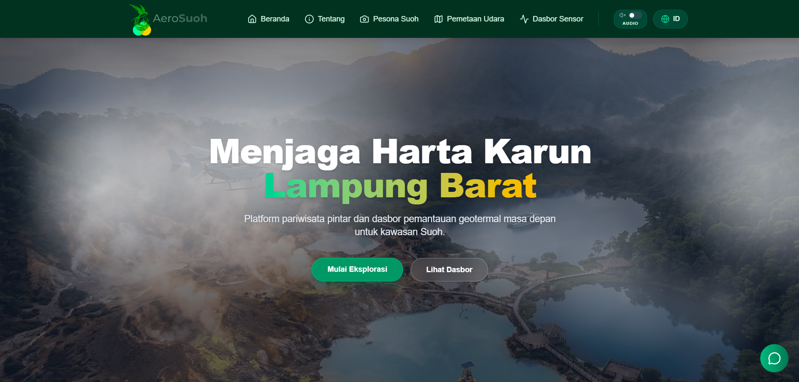

# 🌋 AeroSuoh Eco-Monitor & Smart Tourism (V2)



**AeroSuoh** adalah platform **Pariwisata Ekologis Pintar** dan **Dasbor Pemantauan Geotermal Real-Time** yang didedikasikan untuk mengangkat "Surga Tersembunyi" kawasan Suoh, Kabupaten Lampung Barat ke kancah global. Proyek ini memadukan eksplorasi alam yang indah dengan teknologi pemantauan geotermal modern yang berfokus pada keselamatan wisatawan, pelestarian lingkungan, dan keberlanjutan.

Dibuat khusus untuk mengikuti ajang **Kompetisi POLINELA 2026 - HMJTI**.

---

## ✨ Fitur Utama

- **🗺️ 3D Aerial Explorer (Mapbox GL JS)**: Pemetaan 3D interaktif kawasan Suoh lengkap dengan visualisasi lokasi danau (Danau Asam, Danau Lebar, Danau Minyak) serta kawah panas bumi (Keramikan, Nirwana, Pasir Kuning). Memiliki fitur kamera termal, kompas interaktif, dan penanda koordinat presisi.
- **📊 Real-Time Geothermal Dashboard**: Dasbor sensor geotermal interaktif berbasis visualisasi [Recharts](https://recharts.org/). Memantau suhu permukaan, pH air kawah, tingkat konsentrasi gas sulfur ($H_2S$), serta kecepatan & arah angin dengan indikator keselamatan (*Safe, Caution, Danger*).
- **🤖 AeroBot Smart Assistant**: Chatbot asisten AI interaktif untuk menjawab pertanyaan seputar reservasi tiket, rute perjalanan, prediksi cuaca, rekomendasi pakaian (*outfit*), hingga protokol keselamatan kawah geotermal.
- **🗺️ Interactive Itinerary Planner**: Perencana rute dan jadwal perjalanan harian wisatawan yang dilengkapi kalkulator estimasi biaya wisata otomatis & pemesanan tiket digital (*Day Trip Pass* & *Eco-Staycation*).
- **📚 Ensiklopedia & Wisata Edukasi**: Edukasi interaktif seputar sejarah gempa letusan Suoh 1933, fenomena danau 3 warna, keanekaragaman hayati endemik, serta filosofi kebudayaan lokal Lampung Barat.
- **🌐 Seamless Bilingual Support (ID / EN)**: Dukungan penuh Bahasa Indonesia dan Bahasa Inggris secara instan (*Zero Reload*) melalui `LanguageContext`.
- **🛡️ Panduan & Alert Keselamatan**: Fitur *Safety Guide* & *Live Alert Banner* untuk memperingatkan batas aman daerah kawah aktif dan memberikan panduan tanggap darurat.
- **📱 Responsive & Enterprise Design**: Tampilan modern dengan efek *Glassmorphism*, partikel animasi uap panas bumi (`GeothermalParticles`), transisi *scroll reveal* halus menggunakan Framer Motion, serta error boundary global.
- **🚀 Ultra-Optimized Performance & SEO**: SEO terintegrasi (`sitemap.ts`, `robots.ts`, OpenGraph metadata), custom 404 page, serta pipeline kompresi gambar berbasis Sharp (`compress-images.mjs`).

---

## 🛠️ Teknologi yang Digunakan

### Core & Framework
- **Framework**: [Next.js 16](https://nextjs.org/) (App Router, React 19 Server & Client Components)
- **Library UI**: React 19
- **Bahasa**: TypeScript (`^5.0.0`)

### Styling & Visuals
- **CSS Engine**: Tailwind CSS v4 (`@tailwindcss/postcss`)
- **Animasi & Motion**: [Framer Motion 12](https://www.framer.com/motion/)
- **Ikonografi**: [Lucide React](https://lucide.dev/)

### Data & Pemetaan
- **Map Engine**: [Mapbox GL JS v3](https://www.mapbox.com/) (`mapbox-gl`)
- **Visualisasi Grafik**: [Recharts v3](https://recharts.org/)

### Build Tools & Media
- **Image Compressor**: [Sharp](https://sharp.pixelplumbing.com/) via `compress-images.mjs`
- **Linter**: ESLint v9 (`eslint-config-next`)

---

## 📁 Struktur Direktori Proyek

```text
AeroSuoh-V2/
├── app/                        # Next.js App Router (Pages, Layouts, Metadata)
│   ├── layout.tsx              # Root Layout & Language Context Provider
│   ├── page.tsx                # Halaman Utama (Main Landing Page)
│   ├── error.tsx               # Error Boundary Halaman
│   ├── global-error.tsx        # Global Error Boundary App
│   ├── not-found.tsx           # Halaman Custom 404
│   ├── globals.css             # Konfigurasi Tailwind CSS v4
│   ├── robots.ts               # Generator Dynamic Robots.txt
│   └── sitemap.ts              # Generator Dynamic Sitemap.xml
├── components/                 # Komponen UI Interaktif
│   ├── About.tsx               # Sekilas Suoh & Komitmen SDGs (SDG 8, 11, 13, 15)
│   ├── AerialExplorer.tsx      # Peta Satelit Interaktif 3D (Mapbox GL)
│   ├── BackToTop.tsx           # Tombol Scroll Kembali ke Atas
│   ├── Dashboard.tsx           # Dasbor Sensor Geotermal Real-Time (Recharts)
│   ├── Encyclopedia.tsx        # Ensiklopedia Pengetahuan Geotermal Suoh
│   ├── Footer.tsx              # Footer Navigasi & Hak Cipta
│   ├── GeothermalParticles.tsx # Efek Partikel Uap Panas Bumi Hero Section
│   ├── ItineraryPlanner.tsx    # Perencana Rute Wisata & Booking Tiket
│   ├── LogoPhilosophy.tsx      # Visualisasi Filosofi Logo AeroSuoh
│   ├── Navbar.tsx              # Bar Navigasi Responsif & Switcher Bahasa
│   ├── PhotoSlider.tsx         # Galeri Slider Foto HD Kawasan Suoh
│   ├── RouteAccess.tsx         # Panduan Rute Transportasi & Jalur Akses
│   ├── SafetyAlert.tsx         # Banner Peringatan Dini Geotermal
│   ├── SafetyGuide.tsx         # Panduan Tanggap Keselamatan Kawah
│   ├── SmartAssistant.tsx      # AeroBot AI Assistant Chatbot Interaktif
│   ├── Testimonials.tsx        # Ulasan Pengunjung & Komunitas
│   └── VirtualTour.tsx         # Tur Visual 360° Kawasan Wisata
├── context/
│   └── LanguageContext.tsx     # Global State & Kamus Terjemahan (ID & EN)
├── public/                     # Asset Statis (Gambar, Banner, Logo)
│   └── images/                 # Foto HD Kawasan Wisata
├── compress-images.mjs         # Script Otomatis Kompresi Gambar dengan Sharp
├── next.config.ts              # Konfigurasi Next.js
└── package.json                # Dependensi Proyek & Script Run
```

---

## 📦 Panduan Instalasi & Pengoperasian

### Prasyarat
- **Node.js**: Versi `18.0.0` atau yang lebih baru (disarankan versi LTS).
- **npm** / **pnpm** / **yarn** / **bun**.

### Langkah-Langkah

1. **Clone Repositori**
   ```bash
   git clone https://github.com/HafisYulianto/AeroSuoh-V2.git
   cd AeroSuoh-V2
   ```

2. **Instal Dependensi**
   ```bash
   npm install
   ```

3. **Konfigurasi Environment Variables**
   Buat file `.env.local` atau `.env` di root direktori proyek dan masukkan token Mapbox GL Anda:
   ```env
   NEXT_PUBLIC_MAPBOX_TOKEN=pk.your_mapbox_public_token_here
   ```

4. **Jalankan Mode Pengembang (Development)**
   ```bash
   npm run dev
   ```
   Buka peramban di [http://localhost:3000](http://localhost:3000).

5. **Kompresi Gambar (Opsional)**
   Jika Anda menambahkan gambar PNG baru di folder `public/`, jalankan script kompresi otomatis:
   ```bash
   node compress-images.mjs
   ```

6. **Build untuk Produksi**
   ```bash
   npm run build
   npm run start
   ```

---

## 🌍 Kontribusi Terhadap SDGs

AeroSuoh dikembangkan berlandaskan Tujuan Pembangunan Berkelanjutan (*Sustainable Development Goals* / SDGs) dari PBB:

- 📈 **SDG 8: Pekerjaan Layak dan Pertumbuhan Ekonomi** – Menggerakkan ekonomi lokal masyarakat Suoh melalui pariwisata ekologis yang terstruktur.
- 🏙️ **SDG 11: Kota dan Komunitas yang Berkelanjutan** – Membangun kawasan wisata yang tangguh bencana dan aman bagi pengunjung serta warga sekitar.
- 🌍 **SDG 13: Penanganan Perubahan Iklim** – Pemantauan emisi gas geotermal dan suhu permukaan untuk mendukung peringatan dini iklim/bencana.
- 🌿 **SDG 15: Ekosistem Daratan** – Mengedukasi pengunjung untuk menjaga kelestarian ekosistem danau dan kawah alami.

---

## 👨‍💻 Tim Pengembang

- **[Hafis Yulianto](https://github.com/HafisYulianto)**
- **[Resiana Pahleppi](https://github.com/ResianaPahleppi)**

---

*© 2026 AeroSuoh - Tim HMJTI POLINELA. All Rights Reserved.*
  